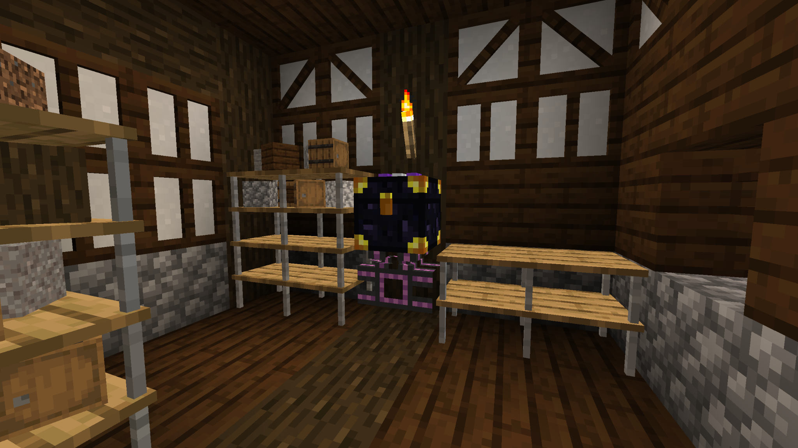
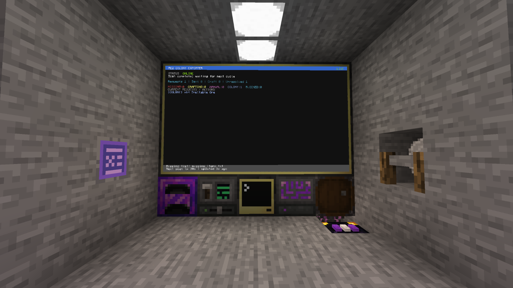

# AE2 MineColonies Colony Exporter

A CC: Tweaked Lua program that connects an **Applied Energistics 2** network to a **MineColonies** colony through an **Advanced Peripherals Colony Integrator** and **ME Bridge**.

The program reads active colony requests, exports available items from AE2, submits AE2 crafting jobs for craftable missing items, and reports anything that still requires manual attention.

It is designed for an **All The Mods 10 (v 5.3.1 tested working)** setup using a storage inventory beside the ME Bridge, an Ender Chest delivery link, and warehouse racks at the colony.

> [!CAUTION]
> The included configuration runs in **live mode by default**:
>
> ```lua
> dryRun = false
> ```
>
> Items may be exported and AE2 crafting jobs may be submitted as soon as the program starts.

## Screenshots

### Warehouse delivery setup

A matching Ender Chest delivers items into MineColonies warehouse racks.



### Advanced Monitor dashboard

The dashboard displays exporter status, sent items, active crafting, missing items, manual requests, colony-managed requests, and output errors.



## Features

- Reads open MineColonies requests through `colony_integrator.getRequests()`.
- Reads stored AE2 items through the confirmed `me_bridge.getItems()` method.
- Exports exact fingerprint matches where possible.
- Falls back to safe name-and-component matching when appropriate.
- Submits AE2 crafting requests with `isCraftable()` and `craftItem()`.
- Exports crafted items automatically after they appear in ME storage.
- Prefers the highest tool or armor tier allowed by the colony request.
- Can substitute Mekanism Tools paxels for pickaxe, axe, and shovel requests from relevant jobs.
- Leaves **Smeltable Ore** requests to the colony rather than draining ores from AE2.
- Reports unavailable Domum Ornamentum blocks as **Architect's Cutter** work.
- Maintains an always-current missing-items report.
- Detects wrong ME Bridge export-side configuration.
- Pauses when the output pipeline appears full or blocked.
- Displays status on a resizable Advanced Monitor wall.
- Persists delivery and crafting state across restarts.

## Tested target

The script was developed around the following ATM10 environment:

| Component | Version |
|---|---:|
| All The Mods 10 | 5.3.1 |
| Applied Energistics 2 | 19.2.17 |
| Advanced Peripherals | 0.7.57b |
| CC: Tweaked | 1.116.2 |
| Minecolonies | 1.1.1218-1.21.1-snapshot |

Compatibility with other versions is not guaranteed.

## Required mods and blocks

### Mods

- Applied Energistics 2
- Advanced Peripherals
- CC: Tweaked
- MineColonies
- Mekanism Tools for paxel substitution
- An Ender Chest or equivalent linked-storage mod
- A pipe or item-transfer mod

### Main blocks

- Advanced Computer
- Advanced Monitor wall
- ME Bridge
- Colony Integrator
- Wired Modems and Networking Cable
- A storage inventory directly beside the ME Bridge
- Source-side Ender Chest
- Matching Ender Chest at the warehouse
- Warehouse racks or another courier-accessible warehouse inventory

## Default physical layout

The default configuration assumes the storage inventory is on the **right side of the ME Bridge**:

```text
AE2 network
    |
ME Bridge --[right]--> storage inventory
                            |
                         item pipe
                            |
                      Ender Chest A
                            ⇅
                      Ender Chest B
                            |
                    warehouse racks
```

The included default is:

```lua
dryRun = false
exportDirection = "right"
```

`exportDirection` is relative to the **ME Bridge**, not the computer or the player's camera view.

If the log reports:

```text
INVENTORY_NOT_FOUND
```

the configured side does not contain an inventory. Change `exportDirection` to the side that physically touches the source inventory.

## Monitor support

The script automatically finds the first connected Advanced Monitor:

```lua
peripheral.find("monitor")
```

The default text scale is:

```lua
monitorTextScale = 0.5
```

A **5-wide × 3-high** Advanced Monitor wall is supported. A **5-wide × 6-high** wall also works and provides additional rows for request details.

The monitor and computer must be on the same CC: Tweaked wired peripheral network. Activate the wired modem attached to the monitor so that its peripheral name appears on the computer.

## Installation

### 1. Download with Pastebin

Upload `startup.lua` to Pastebin, then run:

```text
pastebin get 85XA1g7t startup
```

The filename `startup` causes CC: Tweaked to launch it automatically when the computer boots.

### 2. Reboot

```text
reboot
```

### 3. Confirm startup output

A normal startup should include messages similar to:

```text
Found me_bridge and colony_integrator
Mode: LIVE | export side: right
Found monitor monitor_# (...)
AE2 Colony exporter started
LIVE MODE ENABLED: exports and AE2 crafting requests are active.
```

## Safe first test

Although live mode is the repository default, a cautious first-time test can use:

```lua
dryRun = true
```

Dry-run mode performs scans and reports planned actions without moving items or submitting crafting jobs.

After confirming the displayed actions, restore:

```lua
dryRun = false
```

## Request behavior

### Stored items

When an acceptable item is already in AE2, the exporter sends the requested quantity through the ME Bridge.

Fingerprint matches are preferred because they distinguish items with the same registry name but different components or variants.

### AE2 crafting

When an item is not stored but an AE2 pattern is available, the program:

1. Checks `isCraftable()`.
2. Submits `craftItem()`.
3. Records that the craft was requested.
4. Waits for the result to enter AE2 storage.
5. Exports it during a later scan.

Craft requests are rate-limited to avoid repeatedly submitting the same job.

### Highest allowed tools and armor

For ordinary tool or armor requests, the script parses the MineColonies maximum-level description and prefers the highest permitted tier.

Example for a Diamond-level hoe request:

```text
Diamond Hoe
Iron Hoe
Golden Hoe
Stone Hoe
Wooden Hoe
```

For each tier, it uses a stored item first, then tries AE2 crafting. It only drops to a lower tier when the higher tier is neither stored nor craftable.

Supported equipment includes:

- Hoes
- Pickaxes
- Axes
- Shovels
- Swords
- Helmets
- Chestplates
- Leggings
- Boots

### Paxels

For eligible jobs, pickaxe, axe, and shovel requests can be fulfilled with a Mekanism Tools paxel.

Relevant job patterns include:

```lua
paxelJobPatterns = {
    "mine",
    "miner",
    "builder",
    "builder's hut",
    "construction",
    "quarry",
    "lumberjack",
    "forester",
    "woodworker",
    "stonemason",
    "stone mason",
    "crusher",
    "sifter",
    "composter",
}
```

The script prefers the highest permitted paxel tier that is stored or craftable:

```text
Netherite Paxel
Diamond Paxel
Iron Paxel
Golden Paxel
Stone Paxel
Wood Paxel
```

Paxels do not replace hoes, swords, or armor.

A blacklist prevents inappropriate substitution for roles such as farmers, guards, archers, cooks, and plantation workers.

### Smeltable Ore

Requests named or described as **Smeltable Ore** are intentionally left to MineColonies production:

```text
[COLONY] Smeltable Ore x64 left to colony production
```

This prevents the exporter from continuously pulling arbitrary ores from AE2 into the warehouse.

Additional colony-managed request patterns can be added in `CONFIG.colonyManagedRequestPatterns`.

### Architect's Cutter blocks

Domum Ornamentum blocks are component-sensitive.

- If the exact requested fingerprint already exists in AE2, it can be exported.
- If the exact block is unavailable, the script reports it as a manual Architect's Cutter requirement.
- The log attempts to include texture and block-state component details when present.

## Dashboard categories

| Category | Meaning |
|---|---|
| `SENT` | Items exported successfully |
| `CRAFTING` | AE2 crafting submitted or already running |
| `MISSING` | Not stored and no usable AE2 pattern |
| `MANUAL` | Requires manual Architect's Cutter work |
| `COLONY` | Intentionally left to MineColonies |
| `CONFIG_ERROR` | Wrong bridge side or no adjacent inventory |
| `OUTPUT_FULL` | Output inventory explicitly appears full |
| `OUTPUT_BLOCKED` | Export returned zero for another delivery-path reason |
| `ERROR` | Peripheral, API, or cycle failure |

## Generated files

The program creates or updates:

| File | Purpose |
|---|---|
| `colony_export.log` | Append-only operational log |
| `missing_items.txt` | Current unresolved request list |
| `colony_export_snapshot.txt` | Compact diagnostic request and ME-item snapshot |
| `colony_export_state.txt` | Persistent delivery and crafting state |

`missing_items.txt` and `colony_export_snapshot.txt` are rewritten automatically.

`colony_export_state.txt` should normally be retained. Delete it only when intentionally resetting delivery/crafting history after a major configuration change.

## Updating the program

Stop the running program with `Ctrl+T`, then replace `startup`:

```text
delete startup
pastebin get 85XA1g7t startup
reboot
```

The log, missing-items file, snapshot, and state file do not need to be deleted for a routine code update.

For a completely clean test:

```text
delete startup
delete colony_export_state.txt
delete colony_export.log
delete colony_export_snapshot.txt
delete missing_items.txt

OR

rm startup colony_export_state.txt colony_export.log colony_export_snapshot.txt missing_items.txt
```

Then reinstall and reboot.

## Output storage and warehouse capacity

The source inventory beside the ME Bridge acts as a buffer before the Ender Chest.

The warehouse-side Ender Chest should unload into racks or another inventory MineColonies couriers can access.

Two double racks can work for a small setup, but larger colonies may benefit from:

- More warehouse racks
- A larger warehouse-side buffer
- Faster item pipes
- Round-robin distribution
- Overflow protection

The exporter cannot directly prove that remote racks are full unless those inventories are also exposed to the computer as peripherals. It detects backpressure when the source inventory fills or the ME Bridge export returns zero.

For direct source-buffer checks, expose the inventory over a wired modem and set:

```lua
outputInventoryName = "your_inventory_peripheral_name"
```

## Configuration highlights

```lua
local CONFIG = {
    dryRun = false,
    pollInterval = 30,
    exportDirection = "right",

    enableCrafting = true,
    craftRetrySeconds = 300,
    maxCraftPerCycle = 256,

    preferHighestAllowedGear = true,
    preferPaxelsForRelevantJobs = true,

    monitorTextScale = 0.5,
    outputPauseSeconds = 120,

    stateFile = "colony_export_state.txt",
    logFile = "colony_export.log",
    missingFile = "missing_items.txt",
    snapshotFile = "colony_export_snapshot.txt",
}
```

## Troubleshooting

### `INVENTORY_NOT_FOUND`

The ME Bridge cannot see an inventory on the configured export side.

Verify:

```lua
exportDirection = "right"
```

and confirm the storage block is directly touching the ME Bridge's right side.

### Export moved `0`

Check:

- The source inventory has free space.
- The pipe is extracting from the source inventory.
- Both Ender Chests use the same channel.
- The destination Ender Chest can unload.
- Warehouse racks have capacity.
- The configured bridge side is correct.

### Monitor is blank

On the computer, verify that a monitor peripheral is visible:

```text
peripherals
```

The monitor must be connected through an activated wired modem or directly attached as a peripheral.

### Computer filesystem is full

Delete an old snapshot or log:

```text
delete colony_export_snapshot.txt
delete colony_export.log
```

The current snapshot writer is compact and checks free space before writing.

### Crafting never starts

Confirm:

- The requested item has an AE2 crafting pattern.
- The ME Bridge exposes `isCraftable` and `craftItem`.
- The crafting CPU has capacity.
- The requested components match the pattern.
- The item is not intentionally classified as colony-managed or manual.

## Repository layout

```text
.
├── README.md
├── LICENSE
├── startup.lua
├── advanced-monitor-dashboard.png
└── warehouse-ender-chest-racks.png
```

## Credits

- Advanced Peripherals
- CC: Tweaked
- Applied Energistics 2
- MineColonies
- Mekanism Tools
- The earlier AE2 Colony implementation by `toastonrye`, which informed compatibility handling for request data, fingerprints, tags, components, tool tiers, and crafting behavior

## License

MIT
